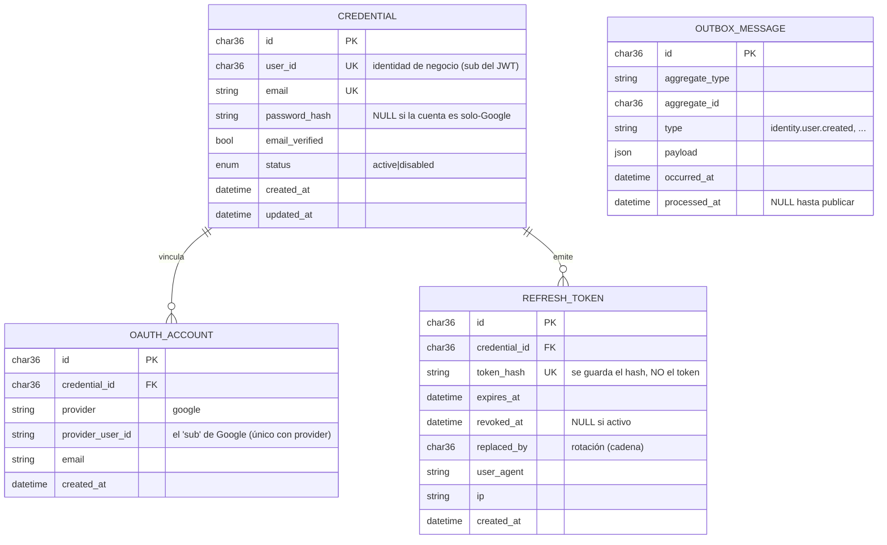
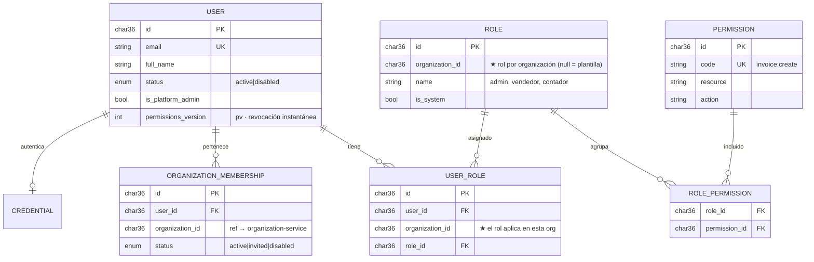
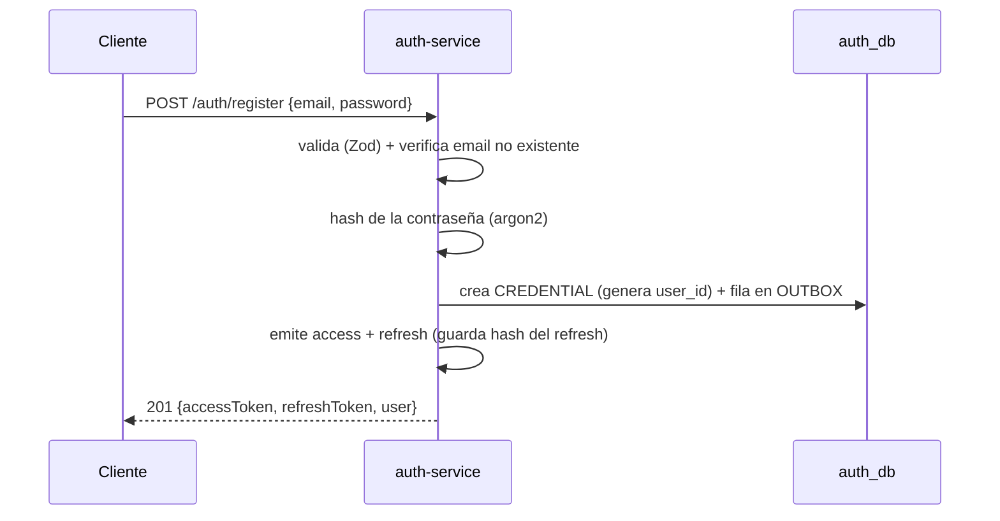
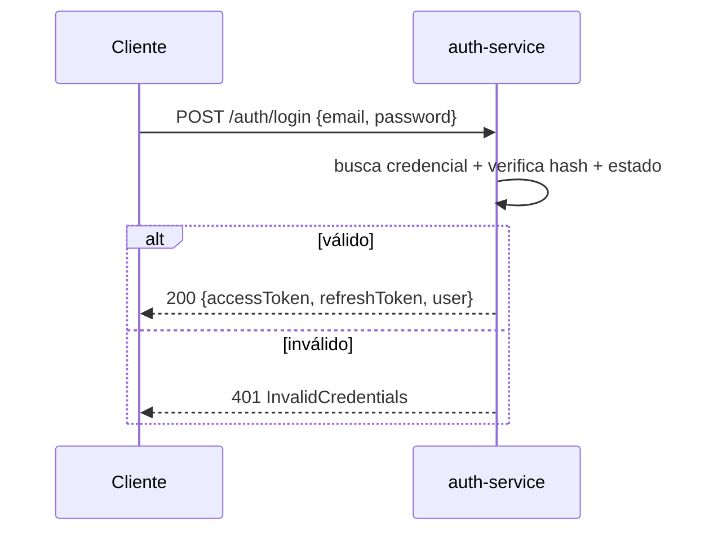
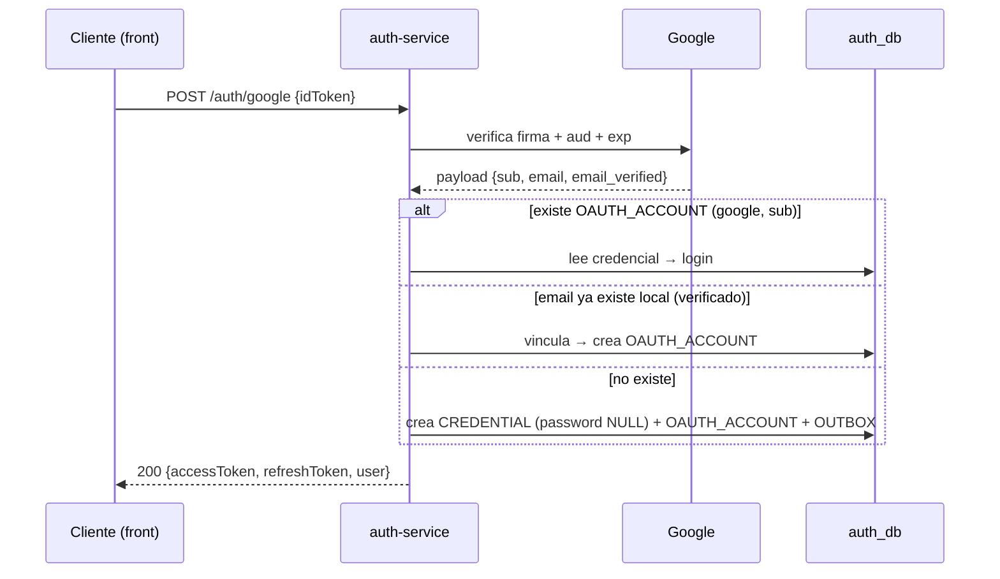
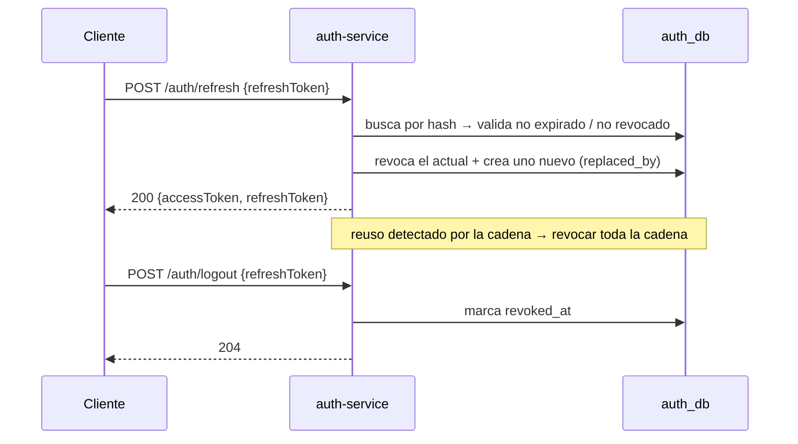

# auth-service (identidad y acceso)

Servicio **único de identidad** del ecosistema CRM. Es el dueño del dominio de identidad y responde a las **dos** preguntas:

- **¿Quién eres?** (autenticación): credenciales, login email/contraseña, **Google Sign-In**, **2FA** (roadmap), emisión y rotación de **JWT**.
- **¿Qué puedes hacer?** (autorización / **RBAC**): usuarios, **roles** por organización, **permisos** (`recurso:acción`), asignaciones y membresía de usuarios a organizaciones.

> **Decisión de diseño.** Antes esto se planteó como dos servicios (`auth` + `identity`). Se **unificaron** porque auth **no puede firmar un token correcto sin los roles/permisos**: comparten ciclo de vida y separarlos solo obligaba a un puente de sincronización por eventos (read-model + `pv`) sin beneficio real. Aquí el JWT se arma leyendo las **propias** tablas RBAC — sin read-model ni consistencia eventual interna. Justificación completa en el vault de arquitectura: `arquitectura/autorizacion.md`.
>
> **Alcance de este repo:** solo el **backend**. Base propia `auth_db`. El despliegue conserva el nombre `auth-service` por continuidad, pero su dominio es el de un `iam-service` (identidad y acceso).

---

## Estado del servicio

Este repo distingue con honestidad lo construido de lo diseñado:

| Área | Estado |
|------|--------|
| **Autenticación** (register, login, Google, refresh/rotación, logout, `/auth/me`) | ✅ **Implementado** |
| JWT **RS256** (firma con privada, verificación con pública) | ✅ Implementado |
| Refresh tokens **hasheados** + rotación + `replaced_by` | ✅ Implementado |
| Clean Architecture + tests (vitest) + migración + Docker/k8s/CI/SOPS | ✅ Implementado |
| **RBAC**: tablas `users`/`roles`/`permissions`/`user_role`/`role_permission`/`organization_membership` | ✅ **Implementado** |
| **Permisos en el JWT** (`org_id`, `permissions[]`, `pv`) | ✅ Implementado |
| Endpoints de administración (`/users`, `/roles`, `/permissions`) | ✅ Implementado |
| **switch-organization**, **complete-profile**, eventos por Outbox (publisher) | ✅ Implementado |
| **2FA** (TOTP) | 🚧 Diseñado |

El JWT lleva `sub`, `email`, `org_id`, `country_code`, `permissions[]` y `pv` (ver [El JWT](#el-jwt-contenido) y [Autorización (RBAC)](#autorización-rbac)).

---

## Stack tecnológico

| Capa | Tecnología | Notas |
|------|------------|-------|
| Runtime | Node.js ≥ 20 | LTS |
| Lenguaje | TypeScript (`strict`) | `type: commonjs` |
| HTTP | Hono.js | framework web |
| ORM | Sequelize + `mysql2` | base propia `auth_db` |
| Validación | Zod + `@hono/zod-validator` | en el borde HTTP |
| JWT | `jose` | **RS256** (firma/verificación) |
| Hash | `argon2` (bcrypt disponible) | nunca texto plano |
| Google | `google-auth-library` | verificación del **ID Token** |
| Tests | `vitest` | unitarios + e2e |
| Infra | Docker · MicroK8s · GitHub Actions · SOPS | despliegue y secretos |

No se accede a tablas de otros servicios: las referencias externas (ej. `organization_id`) son por **ID** + eventos.

---

## Arquitectura limpia (layer-first)

Un solo bounded context, organizado **por capas** con la regla de dependencia hacia adentro:

```
domain  ←  application  ←  infrastructure
                       ←  interface
```

- **`domain`**: entidades, value objects, errores e **interfaces de repositorio**. Cero dependencias de framework.
- **`application`**: casos de uso + **puertos** (hasher, token service, verificador de Google, publisher, unit of work).
- **`infrastructure`** / **`interface`**: implementan esos puertos. Hono vive solo en `interface/`; Sequelize solo en `infrastructure/persistence/`.

### Estructura real de carpetas

```
auth-service/
├── src/
│   ├── domain/
│   │   ├── entities.ts            # Credential, OAuthAccount, RefreshToken
│   │   ├── value-objects.ts       # Email, UserId, ...
│   │   ├── errors.ts              # InvalidCredentials, EmailAlreadyExists, Unauthorized...
│   │   └── repositories.ts        # interfaces (puertos de persistencia)
│   ├── application/
│   │   ├── ports.ts               # PasswordHasher, TokenService, GoogleIdTokenVerifier, ...
│   │   ├── dtos.ts
│   │   ├── session.ts             # armado de la sesión (access + refresh)
│   │   └── use-cases/
│   │       ├── register-with-password.ts
│   │       ├── login-with-password.ts
│   │       ├── login-with-google.ts
│   │       ├── refresh-token.ts
│   │       ├── logout.ts
│   │       └── get-me.ts
│   ├── infrastructure/
│   │   ├── config.ts              # carga y valida env; resuelve claves JWT (archivo o inline)
│   │   ├── persistence/           # models.ts · repositories.ts · sequelize.ts
│   │   ├── security/              # jwt-token-service.ts (jose) · argon2/bcrypt hasher
│   │   └── google/                # google-id-token-verifier.ts
│   ├── interface/
│   │   └── http/                  # app.ts · routes.ts · controllers.ts · middlewares.ts · validators.ts
│   ├── __tests__/                 # vitest (unit + e2e)
│   └── main.ts                    # composition root: arma e inyecta todo
├── migrations/                    # sequelize-cli
├── certs/                         # private.pem / public.pem (gitignored)
├── config/                        # secrets.production.env(.enc) — SOPS
├── k8s/                           # deployment.yaml · service.yaml
├── .github/workflows/deploy.yaml  # CI/CD
├── Dockerfile · .dockerignore · .sops.yaml
├── openapi.yaml
└── .env.example
```

---


## Requisitos previos

- Node.js ≥ 20 y npm
- MySQL ≥ 8 con la base `auth_db` creada
- Par de claves **RS256** en `certs/` (o inyectadas por env)
- Un **Client ID de Google** (para `/auth/google`)
- (Opcional) RabbitMQ, para publicar eventos

Generar el par de claves:

```bash
openssl genpkey -algorithm RSA -out certs/private.pem -pkeyopt rsa_keygen_bits:2048
openssl rsa -pubout -in certs/private.pem -out certs/public.pem
```

---

## Variables de entorno

Copia `.env.example` a `.env`. Las claves JWT se **leen de archivo** por defecto (`*_PATH`); si defines el PEM inline (`JWT_PRIVATE_KEY` / `JWT_PUBLIC_KEY`), este tiene **prioridad** (útil con SOPS en producción).

| Variable | Ejemplo | Descripción |
|----------|---------|-------------|
| `NODE_ENV` | `development` | entorno |
| `PORT` | `3001` | puerto HTTP (interno, detrás del gateway) |
| `DB_HOST` / `DB_PORT` | `localhost` / `3306` | MySQL |
| `DB_USER` / `DB_PASSWORD` | `auth_user` / `secret` | credenciales MySQL |
| `DB_NAME` | `auth_db` | base propia |
| `JWT_PRIVATE_KEY_PATH` | `certs/private.pem` | clave privada (firma) — o `JWT_PRIVATE_KEY` inline |
| `JWT_PUBLIC_KEY_PATH` | `certs/public.pem` | clave pública (verificación; la comparten gateway/servicios) — o `JWT_PUBLIC_KEY` inline |
| `JWT_ACCESS_TTL` | `900` | vida del access token (s) — **15 min** |
| `JWT_REFRESH_TTL` | `2592000` | vida del refresh token (s) — 30 días |
| `JWT_ISSUER` | `auth-service` | claim `iss` (debe coincidir en el gateway) |
| `JWT_AUDIENCE` | `crm-api` | claim `aud` (debe coincidir en el gateway) |
| `GOOGLE_CLIENT_ID` | `xxxx.apps.googleusercontent.com` | audiencia esperada del ID Token |
| `CORS_ORIGIN` | `http://localhost:5173` | origen permitido del front |
| `RABBITMQ_URL` | `amqp://localhost` | conexión a RabbitMQ (opcional) |

> **RS256**: la privada solo vive en auth-service; la pública se distribuye al [gateway] y demás servicios para que verifiquen **sin** llamar a auth en el camino crítico. `JWT_ISSUER`/`JWT_AUDIENCE` deben coincidir con lo que valida el gateway.

---

## Instalación y ejecución

```bash
npm install
cp .env.example .env         # completar valores + generar certs/

npm run db:migrate           # migraciones Sequelize
npm run dev                  # desarrollo (tsx watch)

npm run build && npm start   # producción (tsc → node dist/main.js)

npm test                     # vitest (unit + e2e)
npm run typecheck            # tsc --noEmit
npm run db:migrate:undo      # revertir última migración
```

Escucha en `http://localhost:3001` (según `PORT`). Contrato completo en [`openapi.yaml`](./openapi.yaml).

---

## Modelo de datos (`auth_db`)

### Implementado hoy (autenticación)

Migración `migrations/20260630104535-create-tables.js`:



Notas:

- **`password_hash` es `NULL`** para cuentas solo-Google. Una cuenta puede tener contraseña **y** Google vinculado.
- Índice único `(provider, provider_user_id)` evita duplicar la cuenta Google.
- Refresh tokens **hasheados** (SHA-256); nunca en claro. `replaced_by` encadena la rotación.
- **`user_id`** lo genera auth al registrar; es el `sub` del JWT y la clave con la que el resto del sistema referencia a la persona.

### Implementado (RBAC)

Las tablas de autorización viven en la **misma base**; `credential.user_id` es **FK real** hacia `users.id` (referencia local, sin cruzar servicios):



- **Usuario global** (la persona): no lleva `organization_id`; puede estar en varias orgs vía `organization_membership`.
- **Roles por organización**; hay **plantillas** globales (`organization_id = null`) que se clonan al crear una org.
- **`user_role` lleva `organization_id`**: alguien puede ser "admin" en una org y "vendedor" en otra.
- **`permissions_version` (`pv`)**: contador por usuario para revocación instantánea (ver [Revocación](#revocación-dos-capas)).

---

## Endpoints

### Autenticación (implementado)

| Método | Ruta | Protegido | Descripción |
|--------|------|-----------|-------------|
| `GET` | `/health` | no | healthcheck |
| `POST` | `/auth/register` | no | crear cuenta con email + contraseña |
| `POST` | `/auth/login` | no | login con email + contraseña |
| `POST` | `/auth/google` | no | login o alta con **ID Token** de Google |
| `POST` | `/auth/refresh` | no | nuevo access token (rota el refresh) |
| `POST` | `/auth/logout` | no | revocar un refresh token |
| `GET` | `/auth/me` | **sí** (Bearer) | datos de la sesión actual |

### Administración RBAC (implementado)

| Método | Ruta | Protegido | Permiso |
|--------|------|-----------|---------|
| `GET` | `/users` | **sí** | `user:read` |
| `POST` | `/users/invite` | **sí** | `user:invite` |
| `POST` | `/users/:id/roles` | **sí** | `user:assign_role` |
| `GET` | `/roles` | **sí** | `user:read` |
| `POST` | `/roles` | **sí** | `user:assign_role` |
| `PATCH` | `/roles/:id/permissions` | **sí** | `user:assign_role` |
| `GET` | `/permissions` | **sí** | (catálogo) |

### Onboarding (implementado)

| Método | Ruta | Protegido | Descripción |
|--------|------|-----------|-------------|
| `POST` | `/auth/switch-organization` | **sí** | Reemite el token con otra `org_id` |
| `POST` | `/auth/complete-profile` | **sí** | Fija nombre e identificación del usuario |

Detalle de cuerpos y códigos en [`openapi.yaml`](./openapi.yaml).

---

## El JWT (contenido)

**Access token** — JWT **RS256**, corta vida (~15 min). **Refresh token** — valor opaco aleatorio; en la base solo su **hash**; rota en cada uso.

**Access token (implementado):**

```json
{ "iss": "auth-service", "aud": "crm-api", "sub": "<user_id>",
  "email": "user@org.com", "org_id": "<organization_id>", "country_code": "EC",
  "permissions": ["customer:read", "invoice:create"], "pv": 3,
  "token_use": "access", "iat": 0, "exp": 0 }
```

Los permisos se resuelven con un JOIN local (`user_role → role_permission → permission`), sin read-model ni llamadas externas. El gateway y los servicios verifican con la **clave pública**, sin contactar a auth en el camino crítico.

---

## Autorización (RBAC)

El modelo completo está en el vault (`arquitectura/autorizacion.md`). Resumen de cómo encaja auth-service:

- **auth-service es la fuente de verdad** de roles/permisos y **arma el JWT** con los permisos del usuario en su organización activa.
- **El gateway** hace el enforcement **grueso** (`ruta → permiso`) contra los claims del token, sin llamar a auth.
- **Cada servicio** hace el enforcement **fino** (por recurso) leyendo `X-Permissions` que inyecta el gateway, y aísla por `organization_id`.

### Revocación (dos capas)

1. **TTL corto (15 min)** — un cambio de rol/permiso normal se auto-sana al refrescar: el nuevo token ya trae los permisos frescos.
2. **`permissions_version` (`pv`)** — para revocación **instantánea** (despido, cuenta comprometida): auth incrementa `pv` en la fila del usuario; el gateway compara el `pv` del token contra su caché local (actualizada por evento) y, si no coincide, responde `401` → el cliente refresca. Es un **lookup local**, no una llamada a auth por request.

Además, los **refresh tokens hasheados** ya dan revocación a nivel de sesión (logout / reuso).

---

## Flujos de autenticación

### Registro con email + contraseña



### Login con email + contraseña



### Google Sign-In / Sign-Up (flujo ID Token)

El **front** obtiene el ID Token con Google Identity Services y lo envía. El backend lo **verifica** (firma contra certificados de Google, `aud == GOOGLE_CLIENT_ID`, emisor, expiración). **No** usa `client_secret`.



### Refresh (rotación) y Logout



---

## Seguridad

- Contraseñas con **argon2**; jamás en texto plano.
- Refresh tokens **hasheados** en reposo; rotación + detección de reuso.
- **RS256**: verificación descentralizada con clave pública; algoritmo fijado explícitamente (nunca `alg: none`).
- Validación estricta del **ID Token** de Google: firma, `aud`, `iss`, `exp`; se respeta `email_verified` antes de vincular.
- Respuestas de login **genéricas** (no revelar si el email existe).
- CORS restringido a `CORS_ORIGIN`; el servicio solo es alcanzable tras el gateway (red interna).
- Sin PII sensible ni secretos en el payload del JWT.
- Secretos de producción cifrados con **SOPS** (`config/secrets.production.enc`, `.sops.yaml`).

---

## Eventos (Outbox + RabbitMQ)

Los eventos se escriben en `outbox_messages` dentro de la misma transacción (Outbox pattern). Si `RABBITMQ_URL` está definida, un relay los publica en el exchange `crm.events` (topic) y un consumer escucha `organization.org.updated` para refrescar el `country_code` del read-model de organizaciones.

| Evento | Cuándo | Consumido por |
|--------|--------|---------------|
| `identity.user.created` | Alta / invitación de usuario | realtime |
| `identity.user.role_assigned` | Asignación/cambio de rol (`pv++`) | gateway (caché de `pv`) |
| `identity.user.profile_completed` | Perfil completado | realtime |
| `identity.role.updated` | Cambio de permisos de un rol | gateway (caché de `pv`) |
| `identity.user.disabled` | Baja de usuario | gateway, realtime |

**Consume:** `organization.org.updated` → actualiza `country_code` del read-model.

---

## Despliegue

- **Docker**: `Dockerfile` multi-stage, usuario no-root; no copia `certs/` (se inyectan por Secret).
- **Kubernetes** (`k8s/`): `deployment.yaml` + `service.yaml` (`ClusterIP`, no expuesto directo). La clave pública/privada se inyecta por Secret; `JWT_*_PATH` o PEM inline.
- **CI/CD**: `.github/workflows/deploy.yaml`.
- **Secretos**: SOPS (`.sops.yaml`, `config/secrets.production.enc`).

---

## Convenciones

- **Clean Architecture**: la dependencia apunta hacia adentro; el dominio no conoce frameworks.
- **Una base propia** (`auth_db`); referencias externas por **ID** + eventos, nunca JOIN entre servicios.
- Eventos en **pasado**, namespace por contexto (`identity.user.created`).
- Validación en el **borde** con Zod; invariantes en el **dominio**.
- Errores con cuerpo estándar `{ code, message, details? }` (ver `openapi.yaml`).
- Aislamiento por `organization_id` en toda operación RBAC.
